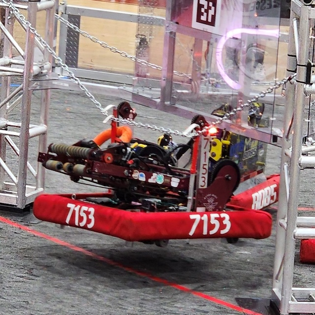

# Crescendo

*"Apollo"* 
FRC 7153, Aetos Dios  
Crescendo, 2024 Season

## Overview
- SDS Mk4i L2 Swerve Modules, field-oriented drive
- 3-DOF arm (2 pivots points and extension), allowed for SOURCE intake and AMP scoring
- Gyro for front orientation detection
- 2 climbing hooks
- ~~Ground intake~~

## Controls
* **Xbox Controller 0:**
    * **Left Joystick:** Drive base strafe
    * **Right Joystick:** Drive base rotation
    * **Left Joystick Held:** Sprint mode
    * ~~**Right Trigger:** Ground intake~~
    * **Right Bumper:** Reverse intake
    * **Y:** Manually run indexer
* **Logitech Joystick 1:**
    * **Button 2:** Source intake
    * **Button 6:** Speaker "long shot" position
    * **Button 4:** Amp scoring position
    * **Button 7:** Speaker "subwoofer shot" position
    * **Button 8:** Full-field pass position
    * **Trigger:** Shoot
    * **Button 5:** Climbing hooks up
    * **Button 3:** Climbing hooks down
    * **Throttle (Up position):** Extend arm to balance while climbing

View Hardware IDs

### CAN IDs
0. RoboRio
1. Main Power Distribution Hub (REV PDH)
2. Front Left Swerve Steer Motor (Neo/CAN Spark Max)
3. Front Right Swerve Steer Motor (Neo/CAN Spark Max)
4. Rear Left Swerve Steer Motor (Neo/CAN Spark Max)
5. Rear Right Swerve Steer Motor (Neo/CAN Spark Max)
6. Front Left Swerve Drive Motor (Neo/CAN Spark Max)
7. Front Right Swerve Drive Motor (Neo/CAN Spark Max)
8. Rear Left Swerve Drive Motor (Neo/CAN Spark Max)
9. Rear Right Swerve Drive Motor (Neo/CAN Spark Max)
10. ~~Ground Intake Motor (Neo550/CAN Spark Max)~~
11. Indexer Motor (Neo550/CAN Spark Max)
12. Arm Lower Right Pivot (Neo/CAN Spark Max)
13. Arm Lower Left Pivot (Neo/CAN Spark Max)
14. Front Left Swerve Steer Encoder (CTRE CANCoder)
15. Front Right Swerve Steer Encoder (CTRE CANCoder)
16. Rear Left Swerve Steer Encoder (CTRE CANCoder)
17. Rear Right Swerve Steer Encoder (CTRE CANCoder)
18. Lower Shooter Motor (Falcon500/TalonFX)
19. Upper Shooter Motor (Falcon500/TalonFX)
20. Right Climber Motor (Neo/CAN Spark Max)
21. Left Climber Motor (Neo/CAN Spark Max)
22. Upper Pivot Motor (Neo/CAN Spark Max)
23. Arm Extension Motor (Neo/CAN Spark Max)
24. ~~Secondary Intake Motor (Neo550/CAN Spark Max)~~

All CTRE devices were on a secondary, CAN-FD bus titled "CANivore".

